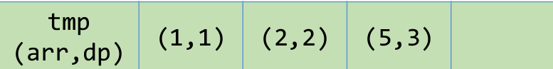

# 薇閣資研社上課簡報
## 動態規劃 Dynamic Programming
### 講師：副社長 劉威廉

---

# 簡介

動態規劃 (Dynamic Programming) 是分治法的延伸。當分治法分割出來的問題，一而再、再而三出現，就運用記憶法儲存這些問題的答案，避免重複求解，以空間換取時間。
動態規劃的過程，就是反覆地讀取數據、計算數據、儲存數據。

---

# 基礎 DP

---s

## 階乘問題

> 有 $Q$ 次詢問，每次問你 $N!$ 取除以 $10^9 + 7$ 的餘數是多少？
$(1 \leq N \leq 10^5, 1 \leq Q \leq 10^5)$
> 

---

### 方法一：一個一個算

每次詢問一個 $N$ 後算出 $N!$ 的大小

```cpp
const int MOD = 1e9 + 7;

int q;  cin >> q;

while (q---) {
    int n;  cin >> n;

    long long an = 1;
    for (int i = 1; i <= n; i++) {
        an *= i;
        an %= MOD;
    }

    cout << an << '\n';
}
```

時間複雜度：$O(QN) \Rightarrow \text{TLE}$

---

### 方法二：使用 DP

因為上一個方法你會發現到同樣的一種階層會算到好幾次，那我們就把他們存起來，下次要用的時候直接拿出來就好

e.g. 算 $10!$ 和 $12!$ 都會用到 $8!$，如果我們有把 $8!$ 的答案存下來就可以必面重複算的時間

---

### 【DP 三步驟】

1. 定義：$dp(x)$ 為 $x!$ 的答案
2. 初始值：$dp(1) = 1$
3. 轉移式：$dp(x) = dp(x-1) \times x$

---

```cpp
const int MOD = 1e9 + 7;
const int maxn = (int)2e5 + 5;

int dp[maxn];

dp[1] = 1;
for (int i = 2; i <= 10000; i++) {
    dp[i] = dp[i - 1] * i;
    dp[i] %= MOD;
}

int q;  cin >> q;

while (q---) {
    int n;  cin >> n;

    cout << dp[n] << '\n';
}
```

時間複雜度：$O(N + Q)$

💡 利用了 DP 的轉移來成功用空間換取時間

---

## 走樓梯問題

> 有一個人要走樓梯，總共有 $N$ 層階梯，每走一步可以往上走 1 或 2 格階梯，請問走上樓梯有幾種方法？請輸出答案除以 $10^9 + 7$ 的餘數。
$(1 \leq N \leq 10^5)$

---

我們一樣用 DP 三步驟來解決這一題：

1. 定義：$dp(x)$ 為走上 $x$ 個階梯的方法數
2. 初始值：$dp(0) = 1$
3. 轉移式：$dp(x) = dp(x-1) + dp(x-2)$

而計算 DP 值又有分為兩種方法：Top-down & Bottom-up

---

### Top-down

顧名思義就是從上往下的順序來求 DP 值

- 好處
    - 不必斤斤計較計算順序
    - 只計算必要的問題，而不必計算所有可能的問題
- 壞處
    - 程式碼採用遞迴結構，不斷呼叫函式，執行效率較差
    - 無法自由地控制計算順序，因而無法妥善運用記憶體，浪費了可回收再利用的記憶體

---

```cpp
const int maxn = (int)2e5 + 5;
const int MOD = 1e9 + 7;

int dp[maxn];

int f(int x) {
    if (dp[x]) return dp[x];
    if (x == 0 or x == 1) return dp[x] = 1;

    return dp[x] = (f(x - 1) + f(x - 2)) % MOD;
}

void solve() {
    int q;  cin >> q;

    while (q---) {
        int n;  cin >> n;

        cout << f(n) << '\n';
    }
}
```

---

### Bottom-up

訂定一個計算順序，然後由最小的問題開始計算，通常只有幾個迴圈

- 好處：與 Top-down 相反
- 壞處：與 Top-down 相反

---

```cpp
const int maxn = (int)2e5 + 5;
const int MOD = 1e9 + 7;

int dp[maxn];

void solve() {
    dp[0] = dp[1] = 1;
    for (int i = 2; i < maxn; i++) {
        dp[i] = dp[i - 1] + dp[i - 2];
        if (dp[i] >= MOD) dp[i] -= MOD;
    }

    int q;  cin >> q;

    while (q---) {
        int n;  cin >> n;

        cout << dp[n] << '\n';
    }
}
```

---

## 題目：
* [薇閣資研社進階測試題 ─ pC. 走階梯](https://codeforces.com/group/m1FMwlvtGj/contest/466863/problem/C)

---

# 背包問題

---

## 0/1 背包問題

題目：*[CSES - Book Shop](https://cses.fi/problemset/task/1158/)*

> You are in a book shop which sells $n$ different books. You know the price $(h_i)$ and number of pages $(s_i)$ of each book.
> 
> 
> You have decided that the total price of your purchases will be at most $x$. What is the maximum number of pages you can buy? You can buy each book at most once.
> 
> $(1 \leq n \leq 10^3, 1\leq x \leq 10^5)$

---

### 【DP 三步驟】

1. 定義：$dp(i, x)$ 為考慮 $1 \dots i$ 個書本並且選擇的書總共 $x$ 元的最大頁數
2. 初始值：$dp() = 0$
3. 轉移式：$dp(i, x) = 
\max
\begin{cases}
dp(i - 1, x) & \\
dp(i - 1, x - h_i) + s_i, & x - h_i \ge 0
\end{cases}$

---

```cpp
const int maxn = (int)1005;
const int maxx = (int)1e5 + 5;

int n, x;
int h[maxn], s[maxn];
int dp[maxn][maxx];

void solve() {
    cin >> n >> x;

    for (int i = 1; i <= n; i++) cin >> h[i];
    for (int i = 1; i <= n; i++) cin >> s[i];

    for (int i = 1; i <= n; i++) {
        for (int j = 0; j <= x; j++) {
            dp[i][j] = dp[i - 1][j];
            if (j - h[i] >= 0) {
                dp[i][j] = max(dp[i][j], dp[i - 1][j - h[i]] + s[i]);
            }
        }
    }

    int an = 0;
    for (int j = 0; j <= x; j++) {
        an = max(an, dp[n][j]);
    }

    cout << an << '\n';
}
```

---

發現到陣列太大了，所以我們可以用一個方法叫做：**滾動 DP**

- 注意到每次算 DP 值的時候只會用到 $i - 1$ 的地方
- 把 DP 陣列想像成一個表格的話就是我們只會用到前一排的值
- 可以使用兩個一維的 DP 陣列或者壓成一個一維的 DP 陣列

---

兩個一維的 DP：

```cpp
const int maxn = (int)1005;
const int maxx = (int)1e5 + 5;

int n, x;
int h[maxn], s[maxn];
int dp[2][maxx];

void solve() {
    cin >> n >> x;

    for (int i = 1; i <= n; i++) cin >> h[i];
    for (int i = 1; i <= n; i++) cin >> s[i];

    for (int i = 1; i <= n; i++) {
        for (int j = 0; j <= x; j++) {
            dp[i % 2][j] = dp[(i - 1) % 2][j];
            if (j - h[i] >= 0) {
                dp[i % 2][j] = max(dp[i % 2][j], dp[(i - 1) % 2][j - h[i]] + s[i]);
            }
        }
    }

    int an = 0;
    for (int j = 0; j <= x; j++) {
        an = max(an, dp[n % 2][j]);
    }

    cout << an << '\n';
}
```

---

一個一維的 DP：

```cpp
const int maxn = (int)1005;
const int maxx = (int)1e5 + 5;

int n, x;
int h[maxn], s[maxn];
int dp[maxx];

void solve() {
    cin >> n >> x;

    for (int i = 1; i <= n; i++) cin >> h[i];
    for (int i = 1; i <= n; i++) cin >> s[i];

    for (int i = 1; i <= n; i++) {
        for (int j = x; j >= 0; j---) {
            if (j - h[i] >= 0) {
                dp[j] = max(dp[j], dp[j - h[i]] + s[i]);
            }
        }
    }

    int an = 0;
    for (int j = 0; j <= x; j++) {
        an = max(an, dp[j]);
    }

    cout << an << '\n';
}
```

時間複雜度：$O(nx)$

---


💡 **提醒**
* 注意題目的範圍來決定 DP 的定義
* 注意滾動後的 $j$ 的迴圈順序

---

## 題目：
* [CSES - Book Shop](https://cses.fi/problemset/task/1158/)
* [AtCoder ABC275 - pF. Erase Subarrays](https://atcoder.jp/contests/abc275/tasks/abc275_f)
* [AtCoder ABC317 - pD. President](https://atcoder.jp/contests/abc317/tasks/abc317_d)

---

# 區間 DP

---

題目：*[AtCoder Educational DP Contest - pN. Slimes](https://atcoder.jp/contests/dp/tasks/dp_n?lang=en)*

> There are $N$ slimes lining up in a row. Initially, the $i$-th slime from the left has a size of $a_i$.
> 
> 
> Taro is trying to combine all the slimes into a larger slime. He will perform the following operation repeatedly until there is only one slime:
> 
> - Choose two adjacent slimes, and combine them into a new slime. The new slime has a size of $x+y$, where $x$ and $y$ are the sizes of the slimes before combining them. Here, a cost of $x+y$ is incurred. The positional relationship of the slimes does not change while combining slimes.
> 
> Find the minimum possible total cost incurred.
> 
> $(1 \le N \le 400, 1 \le a_i \le 10^9)$
> 

---

### 【DP 三步驟】

1. 定義：$dp(l, r)$ 為合併區間 $[l, r]$ 的史萊姆所需要的最短時間
2. 初始值：$dp(i, i) = 0$
3. 轉移式：$dp(l, r) = \min
\begin{cases}
dp(l, k) + dp(k + 1, r) + \sum_{i=l}^{r}a_i
\end{cases}$

列出轉移式後可以發現 $\sum_{i=l}^{r}a_i$ 可以輕鬆的利用前綴合搞定

---

```cpp
const int maxn = (int)405;

int n;
int ar[maxn], pf[maxn];
int dp[maxn][maxn];

void solve() {
    cin >> n;

    for (int i = 1; i <= n; i++) {
        cin >> ar[i];
        pf[i] = pf[i - 1] + ar[i];
    }

    memset(dp, 0x3f3f3f3f, sizeof(dp));

    for (int len = 1; len <= n; len++) {
        for (int l = 1, r = l + len - 1; l <= n and r <= n; l++, r++) {
            if (len == 1) dp[l][r] = 0;
            else {
                for (int k = l; k <= r; k++) {
                    dp[l][r] = min(dp[l][r], dp[l][k] + dp[k + 1][r] + pf[r] - pf[l - 1]);
                }
            }
        }
    }

    cout << dp[1][n] << '\n';
}
```

時間複雜度：$O(N^3)$

---

## 題目：
* [AtCoder DP Contest - pN. Slimes](https://atcoder.jp/contests/dp/tasks/dp_n?lang=en)
* [AtCoder DP Contest - pL. Deque](https://atcoder.jp/contests/dp/tasks/dp_l)
* [Codeforces 607 - pB. Zuma](https://codeforces.com/contest/607/problem/B)
* [CSES - Removal Game](https://cses.fi/problemset/task/1097/)

---

# LIS (Longest Increasing Subsequence)
## 最長遞增子序列
###### Credit：2023 資訊之芽算法班簡報

---

## 子序列
從原本序列中挑幾個數字出來，不改變前後順序而產生的序列
e.g. 
陣列是 $\{1, 5, 2, 4, 6, 3\}$，則 $\{1, 2, 4\}, \{5, 2, 6, 3\}$ 都是它的子序列
這個陣列的 LIS 就是 $\{1, 2, 4, 6\}$，注意 LIS 可能不唯一，現在我們只求最長就好

---

題目：[CSES - Increasing Subsequence](https://cses.fi/problemset/task/1145/)
> You are given an array containing $n$ integers. Your task is to determine the longest increasing subsequence in the array, i.e., the longest subsequence where every element is larger than the previous one.
> A subsequence is a sequence that can be derived from the array by deleting some elements without changing the order of the remaining elements.
> $(1 \le n \le 2 \times 10^5)$

---

### 【DP 三步驟】

1. 定義：$dp(i)$ 為從 $a_1 \dots a_i$ 中取數字，並且以 $a_i$ 為結尾的 LIS
2. 初始值：$dp(0) = 0$
3. 轉移式：$dp(i) = \max \begin{cases} dp(j) + 1, & a_j < a_i ~ \text{and} ~ j < i \end{cases}$

---

```cpp
const int maxn = (int)2e5 + 5;

int n;
int ar[maxn];
int dp[maxn];

void solve() {
    cin >> n;

    for (int i = 1; i <= n; i++) cin >> ar[i];

    for (int i = 1; i <= n; i++) {
        for (int j = 0; j < i; j++) {
            if (ar[j] < ar[i]) 
                dp[i] = max(dp[i], dp[j] + 1);
        }
    }

    int an = 0;
    for (int i = 1; i <= n; i++)
        an = max(an, dp[i]);

    cout << an << '\n';
}
```
時間複雜度：$O(n^2)$

---

## LIS 優化
**觀察**：對於任一個位置的 $i$，如果有一個 $j$ 滿足 $a_j \le a_i$ 且 $dp(j) \ge dp(i)$，則 $dp(i)$ 就永遠不會被用到。
簡單來說就是 $i$ 不管是 $a_i$ 還是 $dp(i)$ 都贏不了別人，那他就沒用了，再見。


---

因此我們開一個陣列 $tmp$ 記錄有可能有用的 $\{a_i, dp(i)\}$。
又因為 LIS 長度每次只會加 1，因此可以再簡化成只記錄陣列的值即可。
此時，$tmp(i) = \min(a_j), ~ \text{where} ~ dp(j) = i$




可以發現到 $tmp$ 裡面是嚴格遞增的！

---

所以我們的轉移式可以改成：
$dp(i) = j + 1, ~ \text{where} ~ tmp(j) < a_i ~ \text{and} ~ tmp(j + 1) \ge a_i$

所以我們可以利用 **二分搜** 來得到我們的 $j$，所以轉移的時間就從 $O(n)$ 降到 $O(\log n)$ 了！

---

```cpp
int n;
vector<int> tmp;

void solve() {
    cin >> n;

    for (int i = 1; i <= n; i++) {
        int x;  cin >> x;
        auto it = lower_bound(tmp.begin(), tmp.end(), x);
        if (it == tmp.end()) {
            tmp.push_back(x);
        } else {
            *it = x;
        }
    }

    cout << (int)tmp.size() << '\n';
}
```
時間複雜度：$O(n \log n)$

---

題目：
* C[SES - Increasing Subsequence](https://cses.fi/problemset/task/1145/)
* [LeetCode - 646. Maximum Length of Pair Chain](https://leetcode.com/problems/maximum-length-of-pair-chain/)
* [Codeforces 977 - pF. Consecutive Subsequence](https://codeforces.com/contest/977/problem/F)
* [Codeforces gym 102951 - pC. LCS on Permutations](https://codeforces.com/gym/102951/problem/C)

---

# LCS (Longest Common Subsequence)
## 最長共同子序列
###### Credit：2023 資訊之芽算法班簡報

---

題目：[AtCoder Educational DP Contest - pF. LCS](https://atcoder.jp/contests/dp/tasks/dp_f?lang=en)
> You are given strings $s$ and $t$. Find one longest string that is a subsequence of both $s$ and $t$.
> $(1 \le |s|, |t| \le 3000)$

---

### 【DP 三步驟】

1. 定義：$dp(i, j)$ 為 $s_{1 \dots i}$ 和 $t_{1 \dots j}$ 的 LCS 長度
2. 初始值：$dp(i, 0) = 0, ~ dp(0, j) = 0$
3. 轉移式：
$dp(i, j) = \max \begin{cases}
dp(i - 1, j - 1) + 1, & \text{where} ~ s_i = t_j \\
dp(i - 1, j) \\
dp(i, j - 1) \\
\end{cases}$

---

```cpp
const int maxn = (int)3005;

string s, t;
int dp[maxn][maxn];

void solve() {
    cin >> s >> t;

    int n = s.size(), m = t.size();
    for (int i = 0; i <= n; i++) {
        for (int j = 0; j <= m; j++) {
            if (i == 0 or j == 0) dp[i][j] = 0;
            else if (s[i - 1] == t[j - 1]) dp[i][j] = dp[i - 1][j - 1] + 1;
            else dp[i][j] = max({dp[i][j], dp[i - 1][j], dp[i][j - 1]});
        }
    }

    cout << dp[n][m] << '\n';
}
```
時間複雜度：$O(nm)$

---

其實也可以求 LCS 的字串ㄛ！
有興趣的同學可以參考這篇文章：[Longest Common Subsequence](https://www.programiz.com/dsa/longest-common-subsequence)

---

## 題目：
* [AtCoder Educational DP Contest - pF. LCS](https://atcoder.jp/contests/dp/tasks/dp_f?lang=en)
* [LeetCode - 72. Edit Distance](https://leetcode.com/problems/edit-distance/)

---

# 位元 DP

---

## Traveling Salesman Problem (TSP)
## 旅行推銷員問題

---

題目：[CSES - Hamiltonian Flights](https://cses.fi/problemset/task/1690/)
> There are $n$ cities and $m$ flight connections between them. You want to travel from Syrjälä to Lehmälä so that you visit each city exactly once. How many possible routes are there?
> Print one integer: the number of routes modulo $10^9+7$.
> $(2 \le n \le 20, 1 \le m \le n^2)$

---

可以發現到 $n$ 的範圍只有 $20$，這時候可以往 $O(2^n)$ 思考。
那我們的 DP 狀態就設為 $2^n$ 次方應該沒毛病吧！

---

### 【DP 三步驟】

1. 定義：$dp(i, mask)$ 為走過狀態為 $mask$ 的城市並且最後停留在城市 $i$ 的方法數
2. 初始值：$dp(0, 1) = 1$
3. 轉移式：
   $dp(i, mask) = \sum dp(j, mask - 2^j), ~ (i, j) \in E ~ \text{and} ~ (mask ~ \& ~ 2^j) > 0$

💡 **想一想**：這一題要用 Bottom-up 的迴圈還是 Top-down 的遞迴呢？算一下時間複雜度吧！

---

```cpp
const int maxn = (int)22;
const int MOD = (int)1e9 + 7;

int n, m;
vector<int> e[maxn];
int dp[maxn][1 << maxn];

int f(int i, int mask) {
    if (i == 0)
        return dp[i][mask] = (mask == 1) ? 1 : 0;

    if (!(mask & (1 << i)))
        return 0;

    if (dp[i][mask]) 
        return dp[i][mask];
    
    int rtn = 0;
    for (int j : e[i]) {
        if (mask & (1 << j)) {
            rtn += f(j, mask - (1 << i));
            if (rtn >= MOD) rtn -= MOD;
        }
    }
    return dp[i][mask] = rtn;
}

void solve() {
    cin >> n >> m;

    for (int i = 1; i <= m; i++) {
        int u, v;  cin >> u >> v;
        e[v - 1].push_back(u - 1);
    }

    cout << f(n - 1, (1 << n) - 1) << '\n';
}
```
時間複雜度：$O(n^2 \times 2^n)$

---

## 題目：
* [CSES - Hamiltonian Flights](https://cses.fi/problemset/task/1690/)
* [AtCoder ABC180 - pE. Traveling Salesman among Aerial Cities](https://atcoder.jp/contests/abc180/tasks/abc180_e?lang=en)
* [CSES - Elevator Rides](https://cses.fi/problemset/task/1653/)

---

# 其他的 DP 主題
## 因為社團時間有限，所以請有興趣的同學自己上網找資料，有問題都可以問我ㄛ

---

* 無限背包問題、有限背包問題
* DAG DP
* 數位 DP
* 輪廓線 DP
* 各種 DP 優化
  * Bitset 優化
  * 矩陣快速冪優化
  * 資料結構優化
  * 單調對列優化
  * 斜率優化