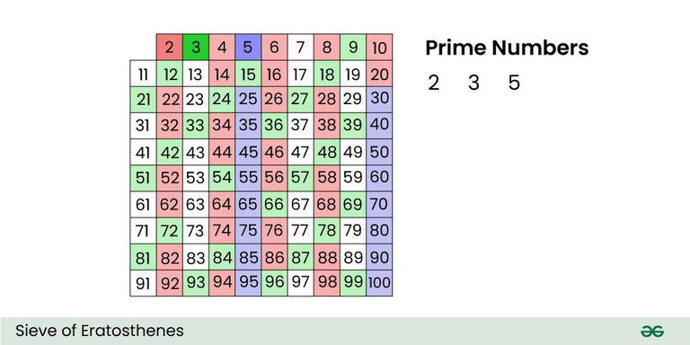

# 薇閣資研社上課簡報
## 數論 Math Theory
### 講師：副社長 劉威廉

---

# Table of Contents
* 質因數分解
* 最大公因數 GCD & 最小公倍數 LCM
* 擴展歐幾里得演算法 Extended Euclidean Algorithm
* 模運算 Modular Arithmetics
* 快速冪
* 結論

---

# 質因數分解

---

## 檢查一個數 $x$ 是不是質數
數學課都學過對吧！我們只要檢查 $2$ 到 $\lfloor \sqrt x \rfloor$ 有沒有都跟 $x$ 互質就好啦！

---

```cpp
bool isPrime(int x) {
    for (int i = 2; i * i <= x; i++) {
        if (x % i == 0) {
            return false;
        }
    }
    return true;
}
```
程式碼：質數測試
時間複雜度：$O(\sqrt x)$

---

## 檢查好多數是不是質數
如果給我 $n$ 個數要我判斷是不是質數，用剛剛的方法需要 $O(n \sqrt x)$
蛤~這樣要好久ㄛ

---

## 埃式篩法 Sieve of Eratosthenes
我們每找到一個質數 $p$，就把他的倍數都刪掉
如果要篩的範圍是 $2$ ~ $m$，這樣的時間複雜度是 $O(m \log \log m)$



---

```cpp
void Sieve_of_Eratosthenes(int m) {
    vector<int> primes;
    vector<bool> isprime(m + 1, true);

    for (int i = 2; i <= m; i++) {
        if (isprime[i]) {
            primes.push_back(i);
            for (int j = i; j <= m; j += i) {
                isprime[j] = false;
            }
        }
    }
}
```
程式碼：埃式篩法

---

雖然複雜度 $O(m \log \log m)$ 已經很夠了，但是線性是不是更舒服 hehe

---

## 線性篩 Linear Sieve
我們可以發現有些數字會被刪掉很多次，像是 $6$ 就會被 $2, 3$ 各被刪掉一次
所以我們控制每個數字都只被刪掉一次 :)

---

我們儲存一個陣列叫做 lpf (lowest prime factor)，記錄每個數字的最小質因數
```cpp
lpf[6] = 2
lpf[21] = 3
```

---

```cpp
void Linear_Sieve(int m) {
    vector<int> primes;
    vector<int> lpf(m + 1, 0);

    for (int i = 2; i < m; i++) {
        // i is a prime number
        if (lpf[i] == 0) { 
            primes.push_back(i);
            lpf[i] = i;
        }

        for (int p : primes) {
            if (i * p >= m) break;
            lpf[i * p] = p;
        }
    }
}
```
程式碼：線性篩

---

# 最大公因數 GCD & 最小公倍數 LCM

---

## 怎麼找 GCD & LCM？
很簡單啦！C++17 以後可以直接用函式搞定！
```cpp
int myGCD = gcd(12, 18);
int myLCM = lcm(12, 18);
```

---

## 輾轉相除法 Euclidean Algorithm
數學課有學過用輾轉相除法求 GCD 對吧！
那我們把他寫成程式碼也可以求ㄛ

---

```cpp
int Euclidean_Algorithm(int a, int b) {
    if (a == 0) return b;
    return Euclidean_Algorithm(b % a, a);
}
```
程式碼：輾轉相除法

---

# 擴展歐幾里得演算法 Extended Euclidean Algorithm
（警告：等等會包含大量數學，若感到身體不適請洽社團老師）

---

## 貝組定理
對於任何整數 $a, b, c$，若 $ax + by = c$ 存在整數解，則 $\gcd(a, b) \mid c$

---

那我們現在的目標是求出一組 $ax + by = \gcd(a, b)$ 的整數解
我們等等設 $\gcd(a, b) = g$

---

首先，我們可以發現當 $a' = 0, b' = g$ 時有一組解是 $(x', y') = (0, 1)$
而這時的 $a', b'$ 是不是跟輾轉相除法最後一步的結果長一樣呢？

---

所以我們要將 $a', b', x', y'$ 藉由剛剛輾轉相除法的步驟推到我們的 $a, b$
這樣我們就可以知道我們要的 $x, y$ 答案是多少了

---

如果現在的時候是 $a_{i + 1} x' + b_{i + 1} y' = g$，
則
$$
\begin{aligned}
    a_{i + 1} & = b_{i} \text{ mod } a_{i} \\
    b_{i + 1} & = a_{i}
\end{aligned}
$$
代入式子以後就變成
$$
(b_i \text{ mod } a_i) x' + a_i y' = d
$$

---

剛剛的式子
$$
(b_i \text{ mod } a_i) ~ x' + a_i y' = d
$$
因為我們要步驟 $i + 1$ 回到步驟 $i$，所以我們整理一下
$$
b_i \text{ mod } a_i = b_i - a_i \times \left \lfloor \dfrac{b_i}{a_i} \right \rfloor
$$
代回剛剛的式子
$$
(b_i - a_i \times \left \lfloor \dfrac{b_i}{a_i} \right \rfloor) ~ x' + a_i y' = g
$$
整理一下就變成
$$
a_i ~ (y' - \left \lfloor \dfrac{b_i}{a_i} \right \rfloor x') ~ + b_ix' = g
$$

---

剛剛的式子
$$
a_i ~ (y' - \left \lfloor \dfrac{b_i}{a_i} \right \rfloor x') ~ + b_ix' = g
$$
和我們要回去的 $a_i x + b_i y = g$ 相比可以發現
$$
\begin{cases}
    x = y' - \left \lfloor \dfrac{b_i}{a_i} \right \rfloor x' \\
    y = x'
\end{cases}
$$

---

Example : 
$$
\begin{CD}
    12 x ~+~ 18 y ~=~ 6 @. x ~=~ -1,~ y ~=~ 1 \\
    @VVV @AA  A \\
    6x ~+~ 12y ~=~ 6 @. x ~=~ 1,~ y ~=~ 0 \\
    @VVV @AAA \\
    0x ~+~ 6y ~=~ 6 @>>> x ~=~ 0,~ y ~=~ 1
\end{CD}
$$

---

恭喜！我們成功從第 $i + 1$ 步回推到第 $i$ 步了！
那我們就一直做一樣的動作，直到最後一層的時候 $(x, y) = (0, 1)$ 我們就可以回推知道答案了！

---

```cpp
pair<int, int> Extended_GCD(int a, int b) {
    if (a == 0) 
        return (pair<int, int>) {0, 1};
    
    auto [x, y] = Extended_GCD(b % a, a);
    return (pair<int, int>) {y - b / a * x, x};
}
```
程式碼：擴展歐幾里得演算法
時間複雜度：$O(\log \min(a, b))$

---

# 模運算 Modular Arithmetics

---

## 同餘
一般我們稱兩個數字 $a, b$ 同餘代表 $a$ 除以 $p$ 的餘數和 $b$ 除以 $p$ 的餘數相同
$$
a \equiv b \pmod p
$$

---

## 模運算性質
平常很常用到 mod 對吧，實際上 mod 跟一般的運算很像，可以加減和相乘
$$
\begin{aligned}
    a & + b \pmod p & \equiv a \pmod p & + b \pmod p \\
    a & - b \pmod p & \equiv a \pmod p & - b \pmod p \\
    a & \times b \pmod p & \equiv a \pmod p & \times b \pmod p \\
    a & ~/~~ b \pmod p & \not\equiv a \pmod p & ~/~~ b \pmod p
\end{aligned}
$$
注意沒有辦法用除的喔！

---

## 模逆元
在數學裡面我們學過，要計算 $a / b$，我們可以寫成 $a \times b^{-1}$，那這樣是不是就解決我們不能用除法的問題了！
這裡我們稱 $b^{-1}$ 是 $b$ 的模逆元或模反元素

---

不過對於一個數 $a$ 和取餘的數 $p$ 來說，$a$ 對 $p$ 有模逆元若且唯若 $\gcd(a, p) = 1$
接下來我們都處理 $p$ 是質數的情形來求模逆元，如果 $\gcd(a, p) \not= 1$ 的話就必須用 Extended Euclidean Algorithm

---

## 費馬小定理 Fermat's Little Theorum

---

> 對於任何整數 $a$，質數 $p$ 都滿足 $a^p - a \equiv 0 \pmod p$，若 $a$ 不是 $p$ 的倍數，則可以推得 $a^{p - 1} \equiv 1 \pmod p$

---

因為
$$
a^{p - 1} \equiv 1 \pmod p
$$
所以
$$
a^{p - 2} \times a \equiv 1 \pmod p
$$
和這個比較一下
$$
a^{-1} \times a \equiv 1 \pmod p
$$
結論
$$
a^{p - 2} \equiv a^{-1} \pmod p
$$

<br />

這樣我們就成功求出 $a$ 的模反元素了！可以開始除囉！

---

# 快速冪

---

## 直接算
要我算 $a^{100}$ 這很簡單，直接跑個 for loop 就好了
但是如果要求的是 $a^{10^9}$ 呢，這樣就頭大了 :(

---

## 分解算
首先我們可以想到：$a^p = a^{p / 2} \times a^{p / 2}$
所以我們是不是一直用 $/~2$ 的方法分解，直到 $a^0 = 1$

---

$$
a^b =
\begin{cases}
    1 &, \text{if $b = 0$} \\
    (a^{b / 2})^2 &, \text{if $b$ is even} \\
    (a^{b / 2})^2 \times a &, \text{if $b$ is odd}
\end{cases}
$$
由此可知，我們把 $b$ 分解成 $\log b$ 層，所以時間複雜度是 $O(\log b)$

---

```cpp
int Fast_Power(int a, int b, int m) {
    if (b == 0) 
        return 1;

    int mid = fstpow(a, b / 2, m);

    if (b & 1) return mid * mid % m * a % m;
    else return mid * mid % m;
}
```
程式碼：快速冪 （遞迴）

---

```cpp
int Fast_Power(int a, int b, int m) {
    int ans = 1;
    while (b) {
        if (b & 1) 
            ans = ans * a % m;
        
        a = a * a % m;
        b >>= 1;
    }
    return ans;
}
```
程式碼：快速冪（迴圈）

---

利用快速冪就可以快速的算出剛剛算不出來的 $a^{p - 2}$ 囉！

---

# 結論

---

辛苦啦！一些基本的數論就到這裡！
其實數論還有很多很多的主題，有興趣就去查查看吧
* Mex
* 歐拉函數 Euler's Totient Function
* 中國剩餘定理 Chinese Reminder Theorem
* 賽局理論 Game Theory
* 矩陣 Matrix & 矩陣快速冪
* 離散對數 Discrete Log
* Pollard Rho Algorithm（酷酷的質因數分解）